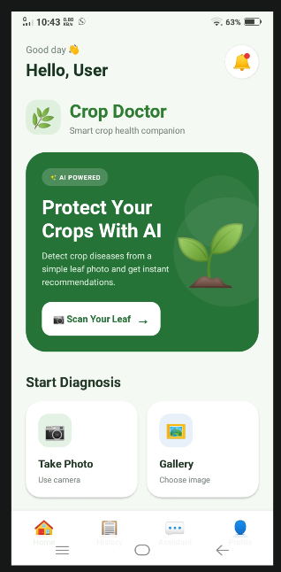
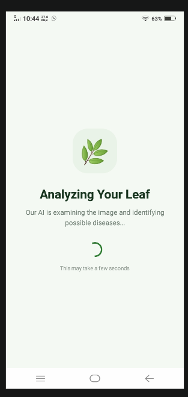
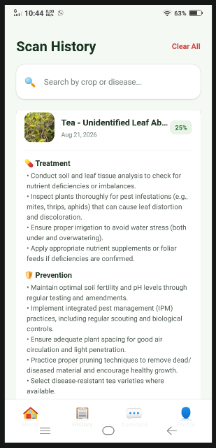
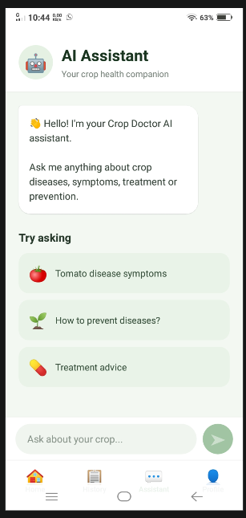

# 🌱 LeafLensAI

### AI-Powered Crop Disease Detection & Agricultural Assistant

**LeafLensAI helps farmers identify crop diseases using AI and get agricultural guidance through a simple mobile application.**

---

## 🚀 Live Demo

📱 **[Download / Test Mobile App](https://expo.dev/accounts/chandu-1112/projects/mobile/builds/09df50cf-f00f-49bf-bba9-298999a7c5e1)**

🔗 **[Live Backend API](https://crop-doctor-backend-sl9n.onrender.com/)**


---

## 📱 Application Screenshots

| 🏠 Home                       | 📷 Disease Detection                    |
| ----------------------------- | --------------------------------------- |
|  |  |

| 🔍 Diagnosis Result               | 🤖 AI Assistant                         |
| --------------------------------- | --------------------------------------- |
|  |  |

---

## 🚨 Problem

Farmers may face difficulty in:

* Identifying crop diseases early
* Understanding disease symptoms
* Accessing agricultural experts
* Knowing what action to take

This can lead to **delayed treatment and potential crop losses**.

---

## 💡 Solution

LeafLensAI provides an AI-powered mobile solution where farmers can:

**📷 Upload leaf image → 🤖 AI analysis → 🔍 Disease diagnosis → 💡 Agricultural guidance**

The application also provides an **AI agricultural assistant** for agriculture-related questions.

---

## ✨ Key Features

* 🌿 **AI Crop Disease Detection**
* 📷 **Image-Based Diagnosis**
* 🤖 **AI Agricultural Assistant**
* 📋 **Disease Information & Recommendations**
* 📜 **Diagnosis History**
* 👤 **User Profile**
* 📱 **Mobile-First Experience**
* ⚡ **FastAPI REST Backend**

---

## 🔄 How It Works

```text
👨‍🌾 Farmer
    ↓
📱 LeafLensAI Mobile App
    ↓
📷 Upload / Capture Leaf
    ↓
⚡ FastAPI Backend
    ↓
🤖 AI Analysis
    ↓
🔍 Disease Diagnosis
    ↓
📋 Result + Recommendations
    ↓
🌱 Farmer Takes Action
```

---

## 🏗️ Architecture

```text
          📱 React Native + Expo
                    │
                    ▼
             ⚡ FastAPI API
                    │
          ┌─────────┴─────────┐
          ▼                   ▼
     🤖 AI Services       🗄️ Gemini api 
          │                   │
          └─────────┬─────────┘
                    ▼
             📋 Diagnosis
                    │
                    ▼
              📱 Mobile App
```

---

## 🛠️ Tech Stack

### 📱 Frontend

* React Native
* Expo
* TypeScript

### ⚙️ Backend

* Python
* FastAPI
* REST APIs


### 🤖 AI
* Gemini API key
* AI-based crop disease analysis
* AI agricultural assistance

### 🔧 Tools

* Git
* GitHub
* JSON
* REST API

---

## 📂 Project Structure

```text
LeafLensAI/
│
├── crop-doctor-backend/
│   ├── app/
│   ├── requirements.txt
│   └── ...
│
├── crop-doctor-mobile/
│   ├── app/
│   ├── components/
│   ├── assets/
│   └── package.json
│
├── screenshots/
│   ├── home.png
│   ├── diagnosis.png
│   ├── result.png
│   └── assistant.png
│
├── .gitignore
└── README.md
```

---

## ⚙️ Run Locally

### 1. Clone

```bash
git clone https://github.com/Chandu-1112/LeafLensAI.git
cd LeafLensAI
```

### 2. Backend

```bash
cd crop-doctor-backend

python -m venv venv
venv\Scripts\activate

pip install -r requirements.txt
```

Create `.env`:

```env
GOOGLE_API_KEY=your_api_key_here
```

Start backend:

```bash
uvicorn app.main:app --reload
```

API documentation:

```text
http://127.0.0.1:8000/docs
```

### 3. Mobile App

Open another terminal:

```bash
cd crop-doctor-mobile
npm install
npx expo start
```

---

## 🔐 Security

* API keys stored in environment variables
* `.env` excluded from Git
* Secrets are not exposed in the mobile application
* Database credentials are kept on the backend

---

## 🚀 Future Scope

* 🌾 More crops and diseases
* 🌐 Regional language support
* 🗣️ Voice-based agricultural assistant
* 🌦️ Weather-based recommendations
* 📡 IoT crop monitoring
* 🧠 Disease severity detection
* 📍 Location-aware agricultural guidance
* 📊 Crop health analytics

---

## 🏆 Hackathon MVP

### **Our Core Demonstration**

```text
📷 Leaf Image
     ↓
🤖 AI Detection
     ↓
🔍 Disease Identified
     ↓
💡 Recommended Action
     ↓
🤖 Ask AI Assistant
```

**LeafLensAI combines AI + Mobile + Backend + Database into one practical agricultural solution.**

---

## 👥 Team — LeafLens AI

| Member                 | Role        |
| ---------------------- | ----------- |
| **Chandu Kumar Reddy** | Team Leader |
| **Dhanavardhan Reddy** | Team Member |
| **Ajay Kumar**         | Team Member |
| **Swarna Kumar**       | Team Member |

---

## 🌱 LeafLensAI

### **See the disease. Understand the problem. Take action.**
